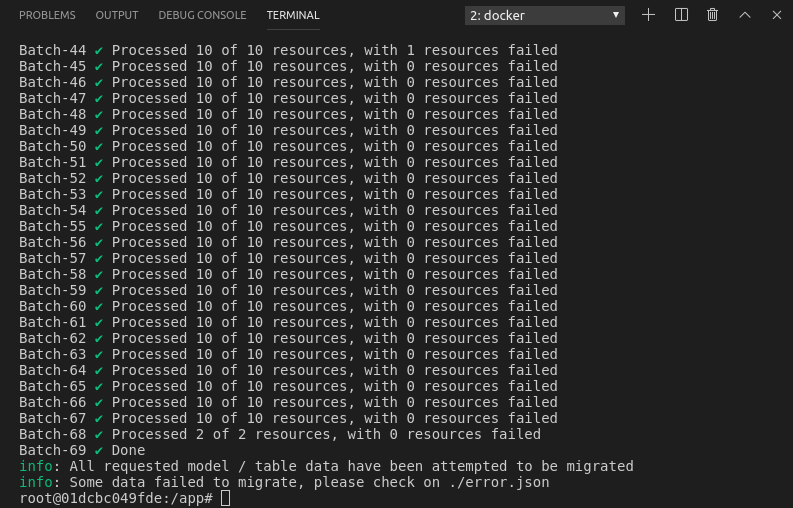
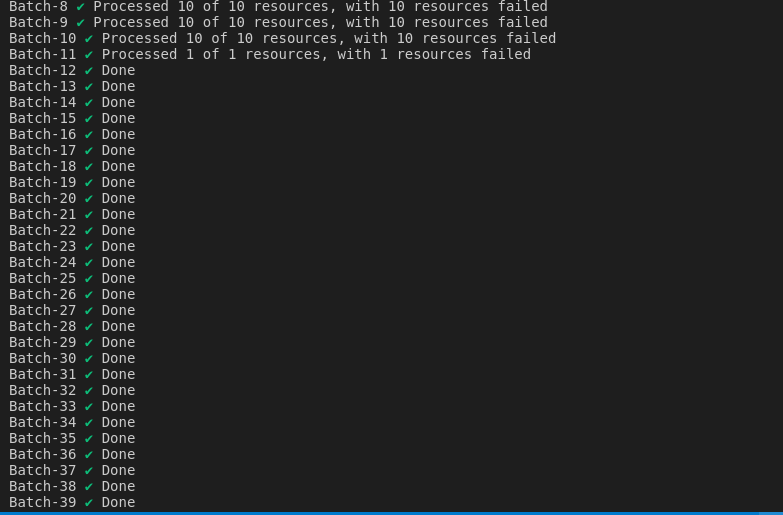

## Verification
- Run containers
```
cd docker
docker-compose up
```
- Insert test data
```
docker cp ./tests/test_data.sql iif_innovator_c:/
docker exec -ti iif_innovator_c bash
# Inside container shell
dbaccess - test_data.sql
```

- Install dependencies dan initialize DB
```
docker exec -ti legacy-challenge-migration-cli bash
# inside container shell
npm i (I faced a problem to build ifxnjs if I only follow the guidance from original version of the CLI)
If the same problem happens to you, run below instead of just npm i

sudo ln -s /home/informix/node-v8.11.3-linux-x64/bin/npm /usr/bin/npm
sudo ln -s /home/informix/node-v8.11.3-linux-x64/bin/node /usr/bin/node
sudo ln -s /home/informix/node-v8.11.3-linux-x64/lib/node /usr/lib/node
sudo npm i

npm run create-tables
or
npm run create-table:challenge
npm run create-table:resource
npm run create-table:resourcerole
npm run create-table:challengetype
npm run create-table:challengehistory
npm run init-es
```

- Run migration command
```
# Still inside legacy-challenge-migration-cli container shell above, continue
export CREATED_DATE_BEGIN=1970-01-01
npm run migrate
or
use specific migrate command to migrate each table separately (e.g. npm run migrate:challenge or npm run migrate:resource)
```

- Run migration API
```
# Still inside legacy-challenge-migration-cli container shell above, continue
export CREATED_DATE_BEGIN=1970-01-01
npm start

# After that you can run migration by requesting the api using the `curl` command:
curl -X POST localhost:3001/v5/challenges/migrations -i

# And check the migration status:
curl localhost:3001/v5/challenges/migrations -i
```

- Run retry command
```
# Still inside legacy-challenge-migration-cli container shell above, continue
npm run retry
or
use specific retry command to retry migration of each table separately (e.g. npm run retry:challenge or npm run retry:resource)
```

- Check data on DynamoDB and ES
```
npm run view-data
npm run view-data:challengehistory
npm run view-data:resource
npm run view-data:resourcerole
npm run view-data:challengetype

npm run view-es-data
npm run view-es-data:resource
npm run view-es-data:resourcerole
npm run view-es-data:challengetype
```

For fail data to be migrated you can see on `error.json`

Additional information for migration of challenge resource:

1.  It can fail if challenge doesn't exist in DynamoDB because it will need to use challenge UUID (not legacy ID) as attribute for inserting resource to DynamoDB
2.  It can fail if resource role doesn't exits in DynamoDB because it will need to use resource role UUID as attribute for inserting resource to DynamoDB
3.  Normally, error.json will contain error message like "One or more parameter values were invalid: An AttributeValue may not contain an empty string" along with resource ID (resource legacy ID) information when the fields required like challengeId or roleId is empty because those data don't exist in DynamoDB tables yet
4. Network connection is needed for fetching challenge types data from remote API when migrating challenges.

*Screenshot* (the screen-shot is just for reference what output the CLI will produce. Because we can use additional data for testing, don't compare screen-shots blindly)

First Migration Command




Second Run Command




## Reference
Most queries are taken from `https://github.com/topcoder-platform/tc-elasticsearch-feeder-service`.
This app act as data feeder for `https://github.com/appirio-tech/ap-challenge-microservice`
