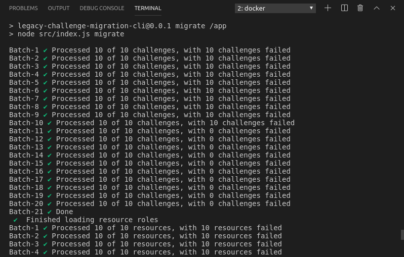
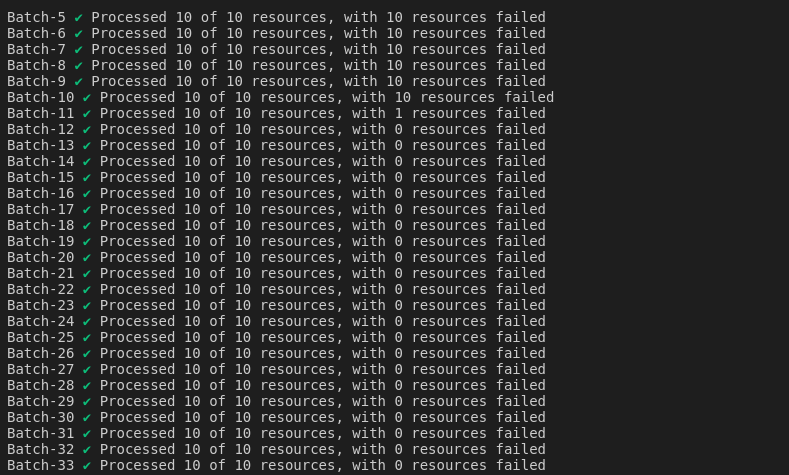
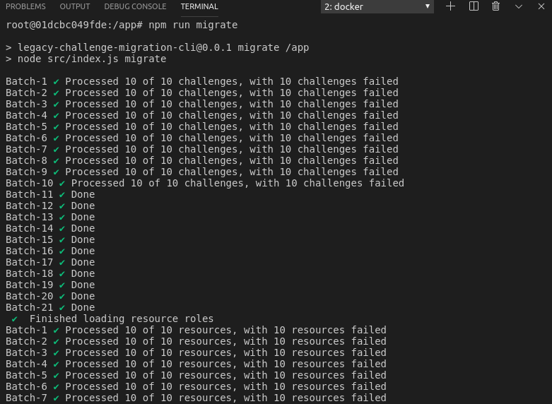
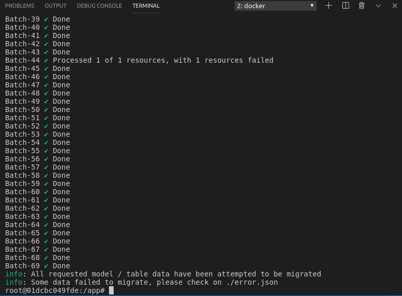

# Legacy Challenge Migration CLI Tool

## Requirement
- docker CE 17+
- docker-compose

## Configuration
See `config/default.js`. Most of them is self explain there.
- `CHALLENGE_TYPE_MAPPING` List of mapping legacy challenge category to new type.
- `BATCH_SIZE` Maximum legacy will be load at 1 query
- `ERROR_LOG_FILENAME` Filename for data that error to migrate.
- `RESOURCE_ROLE` List of resource role to be included in migration

Other configuration is for `informix`, `dynamodb` and `elastic-search` which use same format as `challenge-api`

## Deployment
To simplyfies deployment, we're using docker. To build the images
or run the container:
```
cd <legacy-challenge-migration-cli>/docker
docker-compose up
```
This will automatically build the image if have not done this before.
After container has been run, go to container shell and install dependencies:

```
docker exec -ti legacy-challenge-migration-cli bash
npm i
```

## Command
To run this command you need to run the container first and install dependencies( see above):

- Migrate legacy data (currently supporting challenges and resources) one after another:
`npm run migrate`
- If only specific data wants to be migrated
`npm run migrate:challenge` or `npm run migrate:resource`, please note resource has dependency on challenge so if migration wants to be done separately, please ensure challenge is migrated first before resource aka calling `npm run migrate:challlenge` before `npm run migrate:resource`
- Create DynamoDB tables:
`npm run create-tables`
- If only specific table wants to be created because one table (e.g. Challenge) has existed previously, please run `npm run create-table:resource` or `npm run create-table:resourcerole`
- Create ES index:
`npm run init-es`
- View DynamoDB data:
`npm run view-data` for Challenge data or `npm run view-data:resource` for Resource data
- View ES data:
`npm run view-es-data` only for Chalenge data in ES because Resource is not uploaded toES
- Check linting
`npm run lint`
- Fix linting error:
`npm run lint:fix`

## Verification
- Run containers
```
cd docker
docker-compose up
```
- Insert test data
```
docker cp <submission/test_data.sql> iif_innovator_c:/
docker exec -ti iif_innovator_c bash
# Inside container shell
dbaccess - test_data.sql
```

- Install dependencies dan initialize DB
```
docker exec -ti legacy-challenge-migration-cli bash
# inside container shell
npm i (I faced a problem to build ifxnjs if I only follow the guidance from original version of the CLI)
If the same problem happens to you, run below instead of just npm i

sudo ln -s /home/informix/node-v8.11.3-linux-x64/bin/npm /usr/bin/npm
sudo ln -s /home/informix/node-v8.11.3-linux-x64/bin/node /usr/bin/node
sudo ln -s /home/informix/node-v8.11.3-linux-x64/lib/node /usr/lib/node
sudo npm i

npm run create-tables 
or 
npm run create-table:challenge
npm run create-table:resourcerole
npm run create-table:resource
npm run init-es
```

- Run migration command
```
# Still inside legacy-challenge-migration-cli container shell above, continue
npm run migrate 
or 
use specific migrate command to migrate each table separately (e.g. npm run migrate:challenge or npm run migrate:resource)
```

- Run retry command
```
# Still inside legacy-challenge-migration-cli container shell above, continue
npm run retry
or 
use specific retry command to retry migration of each table separately (e.g. npm run retry:challenge or npm run retry:resource)
```

- Check data on DynamoDB and ES
```
npm run view-data 
npm run view-data:resourcerole
npm run view-data:resource
npm run view-es-data
```

For fail data to be migrated you can see on `error.json`

Additional information for migration of challenge resource:

1.  It can fail if challenge doesn't exist in DynamoDB because it will need to use challenge UUID (not legacy ID) as attribute for inserting resource to DynamoDB
2.  It can fail if resource role doesn't exits in DynamoDB because it will need to use resource role UUID as attribute for inserting resource to DynamoDB
3.  Normally, error.json will contain error message like "One or more parameter values were invalid: An AttributeValue may not contain an empty string" along with resource ID (resource legacy ID) information when the fields required like challengeId or roleId is empty because those data don't exist in DynamoDB tables yet

*Screenshot* (the screen-shot is just for reference what output the CLI will produce. Because we can use additional data for testing, don't compare screen-shots blindly)

First Migration Command




Second Run Command





## Reference
Most queries are taken from `https://github.com/topcoder-platform/tc-elasticsearch-feeder-service`.
This app act as data feeder for `https://github.com/appirio-tech/ap-challenge-microservice`
